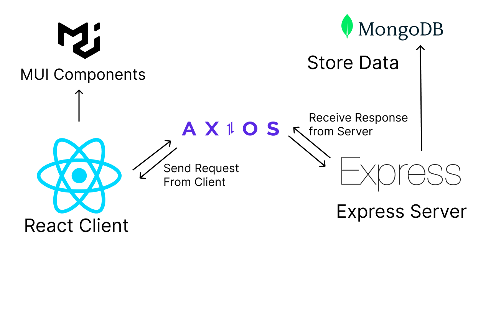
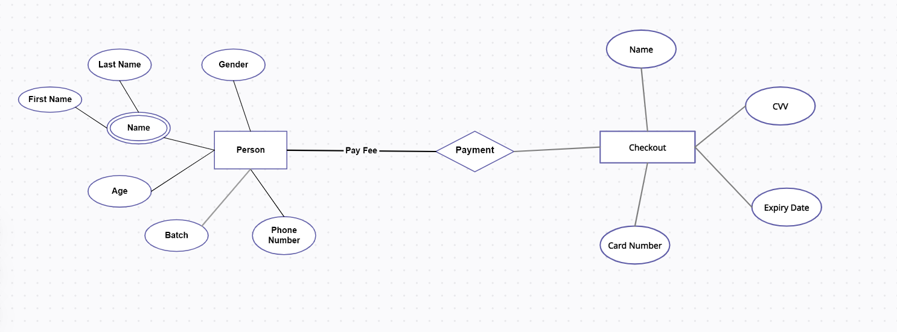
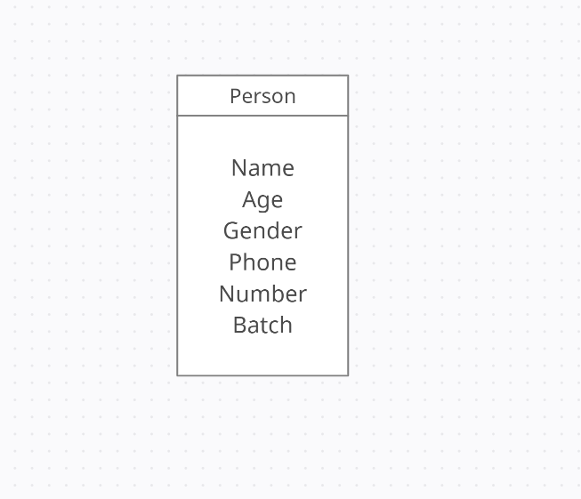

# Flexmoney Assignment

This is the Assignment for Flexmoney Internship.

## Usage

First Setup Client

```
cd client
npm install
npm start
```

Next setup server. Open a new terminal,

```
npm install
npm run dev
```

## Frontend

The Frontend uses the following libraries

<ul>
<li>React</li>
<li>Material UI</li>
<li>Axios</li>
<li>Framer Motion</li>
<li>React Lottie</li>
</ul>

## Backend

The Backend uses the following libraries

<ul>
<li>Express</li>
<li>Mongoose/li>
<li>Nodemon</li>
</ul>

## The Architecture

The architecture of the Application is as follows:



## ER Diagram

The ER and Table for the Database are as follows:



